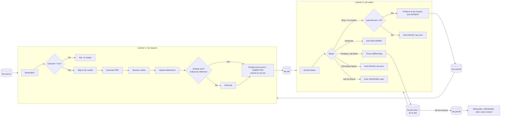
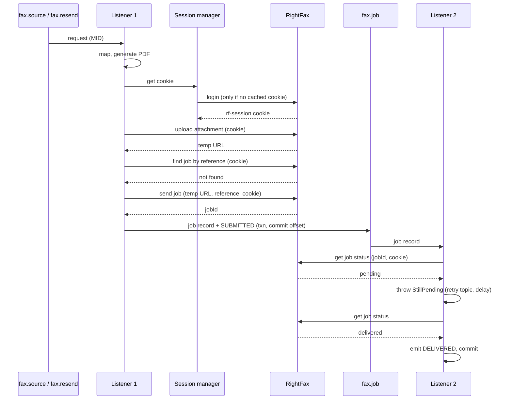

# RightFax Delivery: Spring Kafka Consumer + Job Topic Design

## 0. How to use this document

This is the complete implementation specification for delivering faxes through RightFax from a Spring Boot application using Spring Kafka listeners (no Kafka Streams, no database). Implement exactly what is described here.

- Items marked **TO CONFIRM** are open decisions. Use the stated default until told otherwise and keep them configurable.
- Do **not** invent RightFax endpoint paths, request/response field names, cookie behaviour beyond what is stated, or job status values. Take them from the RightFax API documentation and put them in configuration.
- Where a Spring Kafka behaviour is marked **VERIFY**, check it against the Spring Kafka version in use before relying on it.

---

## 1. Summary

Two Spring Kafka listeners, one shared RightFax session manager, one circuit breaker:

1. **Listener 1, fax request listener.** Consumes fax-channel messages. In one listener invocation it maps the message, generates the PDF, ensures a RightFax session, uploads the PDF (gets a temp URL), checks whether the job was already sent, sends the job (gets a jobId), and publishes a **job record** to the fax job topic. The publish, a SUBMITTED status event and the offset commit happen in one Kafka transaction.
2. **Listener 2, fax job status listener.** Consumes job records and calls RightFax for the job status. If the fax is still pending, it throws an exception so `@RetryableTopic` redelivers the record later through non-blocking retry topics (6s backing off to 30s, 30-minute total timeout). Terminal outcomes emit status events; timeouts go to the DLT as UNKNOWN.
3. **Session manager.** Holds the `rf-session` cookie in memory, logs in once (single-flight), re-logs in once on 401.
4. **Circuit breaker** `rightfax`. Wraps every RightFax call from both listeners. When it opens, every listener container (including the retry-topic containers) is paused; after 10 minutes it goes half-open and the containers resume.

All four RightFax call types hit the **same RightFax server**, so they share one breaker, one session and one capacity budget.

---

## 2. Scope and assumptions

- Runtime: Spring Boot, Spring Kafka (`@KafkaListener`, `@RetryableTopic`), Resilience4j CircuitBreaker, an HTTP client (`RestClient`/`WebClient`) with explicit timeouts.
- Kafka transactions enabled for both listeners (`KafkaTransactionManager` on the container factory, `transaction-id-prefix` on the producer factory).
- **No dedup stage.** Duplicate input messages are the upstream producer's responsibility.
- One input message = one fax, identified by `MID` (unique message ID). Record key everywhere = `MID`.
- Per-recipient ordering is **not** required (TO CONFIRM).
- No database. In-flight polling state lives in Kafka topics (job topic and its retry topics).
- RightFax call types: **Login**, **Upload attachment**, **Send job**, **Get job status**, plus **Find job by reference** if RightFax supports it (see §8). TO CONFIRM.

---

## 3. Topics

| Topic | Key | Producer | Consumer | Purpose |
|---|---|---|---|---|
| `fax.source` (name TBD) | MID | Upstream | Listener 1 | All channels; Listener 1 filters to fax |
| `fax.resend` | MID | Listener 2 | Listener 1 | Original request re-submitted after busy / no answer |
| `fax.request-retry-*` | MID | Spring (retry topics) | Listener 1 | Non-blocking retries for transient failures in Listener 1 |
| `fax.request-dlt` | MID | Spring | `@DltHandler` (Listener 1) | Listener 1 transient failures exhausted; fax was **not** sent |
| `fax.job` | MID | Listener 1 | Listener 2 | Job records (jobId to poll) |
| `fax.job-retry-*` | MID | Spring (retry topics) | Listener 2 | Delayed re-polls |
| `fax.job-dlt` | MID | Spring | `@DltHandler` (Listener 2) | Poll window exceeded: status UNKNOWN |
| `fax.error` | MID | Both listeners | Ops / support | Non-retriable data errors (bad payload, bad PDF, invalid number) |
| `fax.status` | MID | Both listeners | Downstream / support view | Lifecycle status events |

Rules:
- Every produce from inside a listener uses the **transactional** `KafkaTemplate` bound to the container's transaction, so produce + offset commit are atomic.
- Every consumer of `fax.job`, `fax.resend`, `fax.status`, `fax.error` and the DLTs uses `isolation.level=read_committed`.
- Retry topic names follow Spring's suffixing strategy; the names above are illustrative.
- Partition counts: `fax.job` and its retry topics at least equal to Listener 2's total concurrency; `fax.resend` matches `fax.source` or is small.

### 3.1 Job record (`fax.job`)

```json
{
  "mid": "string",
  "jobId": "string",
  "reference": "MID or MID-r{n}",
  "submittedAt": "ISO-8601",
  "resendCount": 0,
  "request": { "...": "original input payload, needed for resend; never the PDF" }
}
```

### 3.2 Status event (`fax.status`)

```json
{
  "mid": "string",
  "status": "SUBMITTED | DELIVERED | FAILED | RESENT | UNKNOWN",
  "jobId": "string | null",
  "reference": "string",
  "resendCount": 0,
  "stage": "REQUEST | POLL",
  "reason": "string | null",
  "rightfaxStatus": "string | null",
  "timestamp": "ISO-8601"
}
```

Events:
- SUBMITTED: Listener 1, after send succeeds or an existing job is found.
- DELIVERED: Listener 2, delivered.
- RESENT: Listener 2, busy / no answer and a resend was published.
- FAILED: Listener 1 (non-retriable data error or exhausted retries) or Listener 2 (permanent failure, resends exhausted).
- UNKNOWN: Listener 2, poll window exceeded or job not found.

### 3.3 Error / DLT record headers

`mid`, `stage` (DESERIALIZE, MAP, PDF, LOGIN, UPLOAD, LOOKUP, SEND, POLL), `errorClass`, `httpStatus`, `attempt`, `reference`, `jobId` (if known), `message`, `timestamp`. Payload: the original request (or job record for Listener 2). Never include the PDF, the cookie or credentials.

---

## 4. End-to-end flow





---

## 5. Listener 1: fax request listener

### 5.1 Container configuration

- Topics: `fax.source`, `fax.resend`.
- Concurrency `C1` (default 3). TO CONFIRM against RightFax capacity.
- `max.poll.records`: 2 (range 1–5).
- `max.poll.interval.ms`: 600000. Rule: `max.poll.records × worst-case record time` must stay well below this. Worst case per record ≈ login 10s + upload 30s + lookup 10s + send 10s + in-thread retries.
- Transactional: container factory with `KafkaTransactionManager`.
- Value deserializer wrapped in `ErrorHandlingDeserializer`.
- Ack mode: record (one record per transaction).

### 5.2 Processing steps (one invocation)

1. **Deserialize.** A `DeserializationException` is non-retriable: publish to `fax.error` (stage DESERIALIZE), emit FAILED if a MID can be read, ack. Configure the error handler so deserialization failures are routed to `fax.error`, not retried.
2. **Fax filter.** If `channel != FAX`: ack, no output.
3. **Map to fax model.** Recipient fax number(s), sender, cover data, document content. On failure: publish to `fax.error` (stage MAP), emit FAILED, ack. Non-retriable.
4. **Generate PDF.** On failure: publish to `fax.error` (stage PDF), emit FAILED, ack. Non-retriable.
5. **Reference.** First submission: `reference = MID`. Resend (from `fax.resend`): `reference = MID-r{resendCount}` from the record header.
6. **Session.** Obtain the cookie from the session manager (§7).
7. **Upload attachment.** PDF + cookie → temp URL.
8. **Already sent?** Find a job by `reference` (§8). If found, take its jobId and go to step 10.
9. **Send job.** Temp URL + recipient + `reference` + cookie → jobId.
10. **Publish.** Produce the job record (§3.1) to `fax.job` and a SUBMITTED event to `fax.status`. Return normally; the container commits the transaction (produce + offset).

Steps 6–9 always run as a unit. A failure anywhere reruns the **whole unit** on retry: a repeated login is a cache hit, a repeated upload just returns a fresh temp URL (an orphaned upload is harmless), and the lookup in step 8 stops a duplicate send. Per-step checkpoints are deliberately **not** used.

### 5.3 Error handling

Classify every exception from steps 6–9:

| Class | Examples | Handling | Breaker |
|---|---|---|---|
| Session expired | 401 on a non-login call | Handled inside the session manager: re-login, repeat once, no attempt counted. A second 401 → Blocking. | No |
| Transient | 5xx, 408, 429, connect/read timeout, connection reset | Blocking retries in-thread: 2 tries, 1s apart. Then non-blocking: `fax.request-retry-*` with delays 30s, 1m, 5m, 10m (whole unit reruns). Honour `Retry-After` where present. | Yes |
| Exhausted | Transient after all retries | `fax.request-dlt` → `@DltHandler`: emit FAILED (stage REQUEST, reason exhausted), alert. Fax was **not** sent; safe to replay because of the reference lookup. | — |
| Non-retriable data | 400, 422, invalid fax number, rejected PDF | Publish to `fax.error`, emit FAILED, ack. Not retried. | No |
| Blocking | Login fails (bad credentials), 403, TLS / certificate error, DNS failure | Record breaker failure; treat as transient for retry purposes so the record is not lost; alert on login failure. | Yes |
| Breaker not permitted | `CallNotPermittedException` | Must **not** consume a retry attempt. Seek back so the record is redelivered after the containers resume. Implementation: blocking retry for this exception with a fixed backoff and unlimited attempts, or manual `Acknowledgment.nack(Duration)`. VERIFY which works with `@RetryableTopic` on your version. | No |

Implementation notes:
- Non-retriable exceptions: catch inside the listener, publish to `fax.error` with the transactional template, return normally. Do not let them reach `@RetryableTopic`, whose default for non-retryable exceptions is the DLT.
- Configure `@RetryableTopic(exclude = {...non-retriable types...})` as a safety net.
- Blocking in-thread retries for transient errors: configure via `RetryTopicConfigurationSupport.configureBlockingRetries(...)` (VERIFY version).
- Retry topic count for Listener 1: one per distinct delay (30s, 1m, 5m, 10m); `attempts = 5` (initial + 4).

---

## 6. Listener 2: fax job status listener

### 6.1 Container configuration

- Topic: `fax.job`, with `@RetryableTopic` creating `fax.job-retry-*` and `fax.job-dlt`.
- Concurrency 1–2. All calls go to the same RightFax server; status polls must not crowd out sends.
- Transactional, `read_committed`.
- `max.poll.records`: 10 (each status call is short); `max.poll.interval.ms`: 300000 default is fine.

### 6.2 Retry configuration

- `@RetryableTopic(attempts = "1000", backoff = @Backoff(delay = 6000, multiplier = 1.5, maxDelay = 30000), timeout = "1800000")`
  - Delays: 6s, 9s, 13.5s, 20s, then 30s repeating. The 30-minute `timeout` governs termination; `attempts` is set high so the timeout is what ends polling.
  - Same-interval topic reuse so the 30s delay uses one retry topic rather than hundreds (`sameIntervalTopicReuseStrategy = SINGLE_TOPIC`). VERIFY attribute names on your version.
- Retry topics are non-blocking: the record moves to a retry topic and that partition pauses until the record is due. The consumer thread never sleeps.
- Window measured from first consumption of the job record. If it must be measured from `submittedAt`, check `submittedAt` in the listener and route to UNKNOWN when exceeded. TO CONFIRM.

### 6.3 Processing

1. Call **Get job status** with jobId + cookie.
2. Map the RightFax status to one outcome via configuration (TO CONFIRM status values):

| Outcome | Handling |
|---|---|
| Pending / in progress | Throw `FaxStillPendingException` → next retry topic. Log at DEBUG only, no stack trace. |
| Delivered | Emit DELIVERED. Return normally. |
| Busy / no answer | If `resendCount < M` (default 2): produce the original `request` to `fax.resend` with headers `resendCount = n+1`, `reference = MID-r{n+1}`; emit RESENT. Else: emit FAILED (reason resends exhausted), publish to `fax.error`. Return normally. |
| Permanent failure (invalid number, rejected, cancelled) | Emit FAILED, publish to `fax.error`. Return normally. |
| Job not found (404 on status) | Emit UNKNOWN, alert. Return normally. **Do not resend.** |

3. Status call errors:

| Class | Handling |
|---|---|
| 401 | Session manager re-login, repeat once |
| Transient (5xx, 429, timeout) | Throw → same retry topics; counts against the 30-minute window |
| Blocking (login fail, 403, TLS) | Breaker failure; throw → retry |
| Breaker not permitted | Seek back without consuming an attempt (same as §5.3) |

4. **`@DltHandler`** on `fax.job-dlt` (window exceeded): emit UNKNOWN (reason poll window exceeded), alert, include jobId for manual check. **Never auto-resend**: the fax may have been delivered.

### 6.4 RightFax built-in retries

TO CONFIRM whether RightFax itself retries busy / no-answer numbers. If it does, set `M = 0` so the two retry layers don't multiply.

---

## 7. RightFax session manager

Shared Spring bean used by both listeners for every RightFax call.

- **Login** returns the `rf-session` cookie. Every other call sends it.
- **Cache: in memory, per instance** (`AtomicReference` or a one-entry Caffeine cache). Not persisted, not in Kafka, not in any shared cache. If the app goes down, the next call logs in again; nothing else is lost because all in-flight state is in Kafka topics.
- **Single-flight**: concurrent callers needing a cookie share one login (lock or shared `CompletableFuture`).
- **Proactive refresh** before expiry if RightFax documents a session lifetime (TO CONFIRM).
- **401** on a non-login call: invalidate, re-login, repeat the call once. Not counted as an attempt. A second 401 is a Blocking error.
- **Login failure** (credentials, 403, TLS, DNS): Blocking; breaker failure; alert.
- **Security**: never log cookie or credentials; mask in HTTP client logs. Credentials from secrets, not config files.
- **Concurrent sessions** TO CONFIRM: each instance holds its own session. If a new login invalidates sessions on other instances, instances will keep logging each other out and a shared session is required.

---

## 8. Duplicate-send protection (critical)

Kafka transactions cover produce + offset, not RightFax. If Listener 1 crashes after **Send job** succeeds but before the transaction commits, the record is redelivered and the fax would be sent twice.

Protection, in order of preference:
1. **Find job by reference** before every send (§5.2 step 8). If a job with this `reference` exists, reuse its jobId. Costs one extra call per fax. TO CONFIRM that RightFax supports lookup by a client-supplied reference, and which field carries it.
2. If RightFax rejects a duplicate reference itself, treat the rejection as "already sent" and look up the jobId.
3. If neither exists, add an external idempotency marker (a small table or cache written **before** send, outside the Kafka transaction). On redelivery, if the marker exists without a published job record, alert for manual check instead of sending.

Every resend uses a new reference (`MID-r{n}`) so the lookup does not mistake the original failed job for the resend.

---

## 9. Circuit breaker

Resilience4j `CircuitBreaker` named `rightfax`, wrapping every RightFax HTTP call from both listeners, including login.

- **Records as failure**: transient and blocking errors.
- **Ignores**: non-retriable data errors, the first 401 (re-login), status "pending" (not an error).
- **Opens on**: failure rate ≥ 50% over a count window of 20 calls (min 10 calls), or slow calls (> 10s) ≥ 50%. These are the "connection config" and "slow call config".
- **On OPEN**: pause **every** listener container: Listener 1, Listener 2, and all retry-topic containers that `@RetryableTopic` creates. Use `KafkaListenerEndpointRegistry` to iterate and `pause()`. VERIFY that retry-topic containers are reachable through the registry on your version. Pausing keeps group membership (no rebalance) and keeps offsets where they are, so no attempts burn while open.
- **Wait in OPEN**: 10 minutes, `automaticTransitionFromOpenToHalfOpenEnabled = true`.
- **On HALF_OPEN**: `resume()` all containers. `permittedNumberOfCallsInHalfOpenState = 5`. Calls beyond the permitted number get `CallNotPermittedException` and are sought back (§5.3).
- **Half-open success** → CLOSED. **Failure** → OPEN, pause again.
- **In-flight records when it opens**: the current poll batch keeps executing and gets `CallNotPermittedException`; those records are sought back and redelivered after resume.
- **Flaking alert**: breaker opens more than 3 times in an hour → alert support.
- Optional: a Resilience4j `Bulkhead` or `RateLimiter` on RightFax if they publish rate or concurrency limits (TO CONFIRM).

---

## 10. Transactions and delivery guarantees

- Both containers run in Kafka transactions: everything produced in a listener invocation (job record, status event, error record, resend) plus the offset commit is atomic.
- Downstream consumers use `read_committed`.
- Guarantees:
  - A fax request is never lost: either a job record is published, or the request is in a retry topic, the DLT or `fax.error`.
  - A job record is never lost: either a terminal status is emitted or it is in a retry topic or the DLT.
  - A fax is sent at most once per reference, **provided** §8 is implemented.
- Not guaranteed: RightFax calls themselves are at-least-once. Upload and status are safe to repeat; send is protected only by §8.

---

## 11. Timeouts and capacity

- HTTP timeouts: connect 2s; read 10s for login, lookup, send and status; 30s for upload.
- HTTP connection pool ≥ total listener concurrency (C1 + C2 + retry containers).
- Listener 1 concurrency × per-record time is the send throughput ceiling; size C1 from expected volume.
- Listener 2 concurrency 1–2: one status call per job every 6–30s is light.
- PDF size: not stored in Kafka (never put the PDF in job records, error records or DLTs).

---

## 12. Configuration (example)

```yaml
rightfax:
  base-url: https://rightfax.example.internal     # TO CONFIRM
  endpoints:                                      # from RightFax API docs
    login: TBD
    upload: TBD
    send-job: TBD
    job-status: TBD
    find-by-reference: TBD                        # §8, TO CONFIRM
  credentials:
    username: ${RIGHTFAX_USER}
    password: ${RIGHTFAX_PASSWORD}
  session:
    cookie-name: rf-session
    refresh-before-expiry: 60s
  timeouts:
    connect: 2s
    read: 10s
    upload-read: 30s
  status-mapping:                                 # TO CONFIRM
    pending: [TBD]
    delivered: [TBD]
    busy-no-answer: [TBD]
    permanent-failure: [TBD]

fax:
  topics:
    source: fax.source
    resend: fax.resend
    job: fax.job
    error: fax.error
    status: fax.status
  request-listener:
    concurrency: 3
    blocking-retries: 2
    blocking-retry-interval: 1s
    retry-delays: [30s, 1m, 5m, 10m]
  status-listener:
    concurrency: 1
    initial-delay: 6s
    multiplier: 1.5
    max-delay: 30s
    timeout: 30m
  max-resends: 2                                  # M, TO CONFIRM

spring:
  kafka:
    producer:
      transaction-id-prefix: fax-tx-
      acks: all
      properties:
        enable.idempotence: true
    consumer:
      isolation-level: read_committed
      enable-auto-commit: false
      max-poll-records: 2                         # Listener 1; override for Listener 2
      properties:
        max.poll.interval.ms: 600000

resilience4j.circuitbreaker.instances.rightfax:
  sliding-window-type: COUNT_BASED
  sliding-window-size: 20
  minimum-number-of-calls: 10
  failure-rate-threshold: 50
  slow-call-duration-threshold: 10s
  slow-call-rate-threshold: 50
  wait-duration-in-open-state: 10m
  automatic-transition-from-open-to-half-open-enabled: true
  permitted-number-of-calls-in-half-open-state: 5
```

---

## 13. Spring Boot implementation outline

- `RightFaxSessionManager` (bean): cookie holder, single-flight login, `withSession(call)` wrapper doing the 401 re-login-once.
- `RightFaxClient` (bean): `login()`, `upload(pdf)`, `findByReference(ref)`, `sendJob(tempUrl, recipient, ref)`, `getJobStatus(jobId)`. Each goes through `sessionManager.withSession(...)` and the `rightfax` breaker. Maps HTTP errors to typed exceptions: `RightFaxTransientException`, `RightFaxDataException`, `RightFaxBlockingException`, `RightFaxSessionExpiredException`.
- `FaxRequestListener`: `@KafkaListener(id = "fax-request", topics = {source, resend})` + `@RetryableTopic` per §5.3 + `@DltHandler`.
- `FaxJobStatusListener`: `@KafkaListener(id = "fax-job-status", topics = job)` + `@RetryableTopic` per §6.2 + `@DltHandler`.
- `FaxStillPendingException`: retryable, logged at DEBUG.
- `BreakerContainerController`: subscribes to the breaker's `onStateTransition`; OPEN → pause all containers; HALF_OPEN → resume all; counts opens per hour for the flaking alert.
- `FaxStatusPublisher`: builds status events; always uses the transactional template.
- `FaxErrorPublisher`: builds error records with headers (§3.3).
- Startup validation (fail fast): RightFax base URL, endpoints, credentials present, status mapping complete.

---

## 14. App-level errors

- **Config load error** (blocking): missing or invalid RightFax config or credentials. Fail startup.
- **Listener thread error**: unexpected exception escaping classification. Treat as transient (retry path), log with MID, alert if repeated.
- **Uncaught / app down**: nothing in flight is lost. Requests sit in `fax.source` / `fax.resend` / retry topics; jobs sit in `fax.job` / retry topics. Only the in-memory cookie is lost, and it is re-created on the next call.

---

## 15. Observability

Metrics:
- RightFax call count, latency and outcome class per endpoint.
- Login count; 401 re-login count; login failures.
- Breaker state, transitions, opens per hour.
- Consumer lag on `fax.source`, `fax.resend`, `fax.job` and every retry topic (job retry lag ≈ faxes awaiting delivery confirmation).
- Counts per status: SUBMITTED, DELIVERED, FAILED, RESENT, UNKNOWN.
- DLT counts (`fax.request-dlt`, `fax.job-dlt`).
- Time from SUBMITTED to DELIVERED.

Alerts:
- Any UNKNOWN (manual check needed).
- Any `fax.request-dlt` record.
- Login failure.
- Breaker open; flaking (> 3 opens / hour).
- Lag on `fax.job` retry topics above threshold.

Support view (optional): consume `fax.status` into a queryable view keyed by MID for "where is fax X" questions, since in-flight jobs are spread across retry topics.

Logs: MID, reference, jobId, stage, attempt on every line. Never the cookie, credentials, fax number in full (mask), or PDF content.

---

## 16. Edge cases checklist

- Crash after send, before commit → redelivery → lookup by reference finds the job → no second fax (§8).
- Crash after commit → nothing to redo.
- Upload succeeded, send failed → whole unit reruns; new upload, new temp URL.
- Session expires → 401 → re-login once.
- Many threads need a cookie at once → single login.
- Breaker opens mid-batch → remaining calls not permitted → sought back → resumed after half-open.
- Long outage → all containers paused; no attempts burn; resumes gradually.
- Fax delivered but status calls keep failing → 30-minute window → UNKNOWN, never resend.
- Busy / no answer → resend with `MID-r{n}`, up to M times.
- Job not found on status → UNKNOWN, alert, no resend.
- Non-fax message → ack, no output.
- Duplicate input from upstream → sends twice (upstream's responsibility; no dedup here).
- Rebalance → offsets and retry topics carry all state; nothing local to restore.

---

## 17. Testing

- `@EmbeddedKafka` + WireMock for RightFax.
- Retry delays shortened in tests.
- Cases: happy path; non-fax filtered; mapping and PDF failures → `fax.error`; 401 then success (no attempt counted); transient on upload, lookup, send (blocking then non-blocking retries, then request DLT); data error on send → `fax.error`; reference lookup finds existing job → no send; pending ×N then delivered; busy → resend with `MID-r1`; resends exhausted → FAILED; permanent failure; job not found → UNKNOWN; poll window exceeded → job DLT → UNKNOWN; breaker opens → all containers paused, no attempts consumed, resume on half-open; crash simulation between send and commit → exactly one send.

---

## 18. Open items (TO CONFIRM)

1. RightFax endpoint paths, request/response fields, cookie lifetime, job status values.
2. Find job by client reference: supported? Which field? Are duplicate references rejected?
3. Concurrent sessions per service account across instances.
4. Does RightFax retry busy / no-answer itself (affects M)?
5. Poll window (default 30 min) and whether it counts from `submittedAt`.
6. Max resends M (default 2).
7. RightFax rate / concurrency limits (bulkhead or rate limiter).
8. Topic names and partition counts.
9. Does RightFax offer a completion callback / webhook? If yes, Listener 2 becomes a fallback for jobs whose callback never arrives.
10. Spring Kafka version (affects the VERIFY items: blocking retries with `@RetryableTopic`, topic reuse strategy, pausing retry containers via the registry, `CallNotPermittedException` handling).
