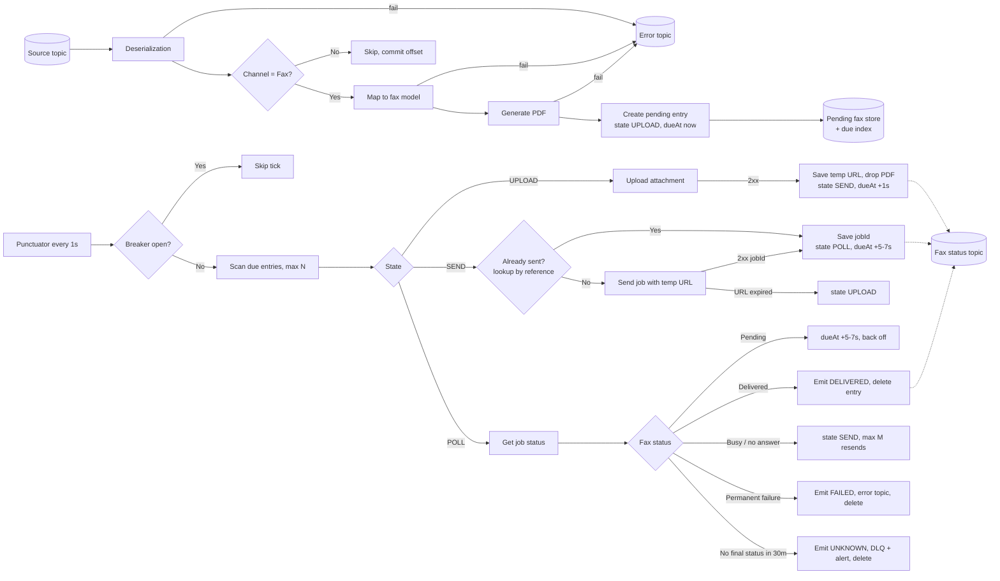

# RightFax Delivery Flow: Implementation Spec

Kafka Streams (Spring Boot) application that takes fax-channel messages, maps them, generates a PDF, and delivers the PDF through RightFax using a state-store-driven state machine. Every RightFax call goes through a shared session manager and a circuit breaker.

This document is the complete specification. Implement exactly what is described. Anything marked **TO CONFIRM** is an open decision; use the stated default until told otherwise. Do not invent RightFax endpoint paths, field names or status codes: take them from the RightFax API documentation and put them in configuration.

---

## 1. Scope and assumptions

- Runtime: Spring Boot, Kafka Streams (Processor API for the stateful part), Resilience4j circuit breaker.
- Processing guarantee: `processing.guarantee=exactly_once_v2`.
- State store: RocksDB, changelog-backed (default Kafka Streams persistent store). Not Hazelcast.
- **No dedup stage in this flow.** Duplicate suppression is the responsibility of the upstream producer. Do not add a dedup store.
- Unit of work: one input message = one fax, identified by `MID` (message ID, unique per message).
- Per-recipient ordering is **not** required. Each fax is independent. (TO CONFIRM; if ordering is needed, add key-level parking.)
- RightFax interaction is exactly four call types: **Login**, **Upload attachment**, **Send job**, **Get job status**. A fifth, **Find job by reference**, is required if RightFax supports it (see §7.3).

---

## 2. End-to-end flow



All RightFax calls (upload, lookup, send, status) go through the **session manager** (§5) and the **circuit breaker** (§9).

---

## 3. Topics

| Topic | Purpose | Written by |
|---|---|---|
| `fax.source` (name TBD) | Input messages, all channels | Upstream |
| `fax.error` | Non-blocking, non-retriable errors (bad data). Offset is committed and the stream moves on. | Topology sink |
| `fax.dlq` | Retriable errors that exhausted attempts; UNKNOWN outcomes | Topology sink |
| `fax.status` | Status events per fax lifecycle transition | Topology sink |
| Changelog topics | Internal, for the pending store and due index | Kafka Streams |

Rules:
- **Every output goes through the topology** (`context.forward()` to named sink nodes, or `split()`/`to()`). Never use `KafkaTemplate` for error, DLQ, status or any other output: it is outside the exactly-once transaction and will produce duplicates on replay.
- All consumers of `fax.status`, `fax.error` and `fax.dlq` must use `isolation.level=read_committed`.

### 3.1 Status event schema (`fax.status`)

```json
{
  "mid": "string",
  "status": "UPLOADED | SUBMITTED | DELIVERED | FAILED | UNKNOWN",
  "jobId": "string | null",
  "attempt": 0,
  "resendCount": 0,
  "reason": "string | null",
  "rightfaxStatus": "string | null",
  "timestamp": "ISO-8601"
}
```

Emit one event on each transition: after upload succeeds (UPLOADED), after send succeeds or an existing job is found (SUBMITTED), and on each terminal outcome (DELIVERED, FAILED, UNKNOWN).

### 3.2 Error / DLQ record

Original payload (mapped fax model, not the PDF bytes) plus headers: `mid`, `stage` (DESERIALIZE, MAP, PDF, UPLOAD, SEND, POLL), `errorClass`, `httpStatus`, `attempts`, `message`, `timestamp`.

---

## 4. Stateless stages (in order)

1. **Source**: consume `fax.source`.
2. **Deserialization**: failure → `fax.error` (non-blocking). Use a deserialization exception handler that routes to the error topic through the topology, or deserialize as bytes and parse inside a processor so failures can be forwarded.
3. **Fax filter**: `channel == FAX`. Non-fax records are dropped (no output, offset committed).
4. **Map to fax model**: build recipient number(s), sender info, cover data and document content. Failure → `fax.error`.
5. **Generate PDF**: render from the fax model. Failure → `fax.error`.
6. **Create pending entry**: write a new entry (§6) with `state=UPLOAD`, `dueAt=now`, `attempts=0`, plus a due-index row. No RightFax call happens here; all external calls happen in the punctuator.

---

## 5. RightFax session manager

A single shared component (Spring bean) used by every RightFax call.

- **Login**: calls the RightFax login endpoint with configured credentials and receives the `rf-session` cookie.
- **Every subsequent RightFax call** (upload, lookup, send, status) must send the `rf-session` cookie.
- **Cache**: in memory, per application instance (an `AtomicReference` or a single-entry Caffeine cache). Not persisted, not in the state store, not in Hazelcast. Losing it on restart is fine: the next call logs in again.
- **Single-flight login**: if many calls need a cookie at once, only one login request is made; the others wait for its result (lock or shared `CompletableFuture`).
- **Proactive expiry**: if RightFax documents a session lifetime, refresh shortly before it. (TO CONFIRM: session lifetime.)
- **401 handling**: on a 401 from any non-login call, invalidate the cookie, log in again, and repeat the call **once**. This retry does **not** count as an attempt. A second 401 after re-login is treated as a blocking error.
- **Login failure** (bad credentials, 403, TLS/DNS failure) is a **blocking** error and is recorded as a circuit breaker failure.
- **Security**: never log the cookie value or credentials. Mask them in HTTP client logging.
- **Concurrent sessions**: each instance holds its own session. TO CONFIRM whether the RightFax service account allows multiple concurrent sessions. If logging in on one instance invalidates sessions on other instances, the instances will keep logging each other out; in that case a shared session cache is required.

---

## 6. Pending fax store

Two RocksDB stores, both changelog-backed.

### 6.1 `pending-fax-store` (key: `MID`)

| Field | Type | Notes |
|---|---|---|
| `mid` | string | Key |
| `state` | enum | `UPLOAD`, `SEND`, `POLL` |
| `faxModel` | object | Mapped fax data (needed for send and for error records) |
| `pdfBytes` | bytes / null | Present only in `UPLOAD`; set to null once upload succeeds |
| `tempUrl` | string / null | From upload response |
| `tempUrlReceivedAt` | timestamp / null | Used to decide whether the URL may have expired |
| `jobId` | string / null | From send response or lookup |
| `reference` | string | Our reference sent with the job: `MID` for the first send, `MID-r{n}` for resends |
| `attempts` | int | Attempts for the **current** step; reset to 0 on each successful transition |
| `resendCount` | int | Number of resends after busy / no answer |
| `createdAt` | timestamp | |
| `submittedAt` | timestamp / null | Start of the poll window |
| `dueAt` | timestamp | Next time the punctuator should act on this entry |
| `lastError` | string / null | |

### 6.2 `fax-due-index` (key: `dueAt|MID`, value: empty)

- Zero-pad `dueAt` (epoch millis) so lexical order equals time order.
- Every time `dueAt` changes, delete the old index key and write the new one in the same processing step.
- When an entry is deleted, delete its index key.

### 6.3 Size limit

The changelog record contains `pdfBytes` while in `UPLOAD`. Check the largest expected PDF against the changelog topic's `max.message.bytes` and the producer's `max.request.size` (default about 1 MB). Either raise both, or store only `faxModel` and regenerate the PDF at upload time. (TO CONFIRM: maximum PDF size.)

---

## 7. State machine (punctuator)

One wall-clock punctuator per task, every **1 second**:

```
punctuate(now):
  if breaker.state == OPEN: return
  limit = (breaker.state == HALF_OPEN) ? N_HALF_OPEN : N
  for key in dueIndex.range(MIN, now) take limit:
      entry = pendingStore.get(mid)
      switch entry.state:
          UPLOAD -> doUpload(entry)
          SEND   -> doSend(entry)
          POLL   -> doPoll(entry)
```

All store writes, deletes and forwards inside `punctuate()` are part of the exactly-once transaction.

### 7.1 Transition table

| State | Action | Outcome | Next |
|---|---|---|---|
| UPLOAD | Upload attachment (PDF + cookie) | 2xx, temp URL returned | Save `tempUrl`, null `pdfBytes`, `state=SEND`, `dueAt=now+1s`, `attempts=0`, emit UPLOADED |
| SEND | Find job by reference (if supported) | Job found | Save `jobId`, `state=POLL`, `submittedAt=now`, `dueAt=now+5-7s`, emit SUBMITTED |
| SEND | Send job (temp URL, recipient, reference) | 2xx, jobId returned | Same as above |
| SEND | Send job | Temp URL expired / not found | `state=UPLOAD`, `dueAt=now` (PDF must be available: regenerate from `faxModel` if `pdfBytes` is null). Does not count as an attempt. |
| POLL | Get job status (jobId + cookie) | Pending / in progress | `dueAt=now+5-7s`; after 5 minutes of polling, back off to 30s |
| POLL | | Delivered | Emit DELIVERED, delete entry |
| POLL | | Busy / no answer | If `resendCount < M`: `resendCount++`, `reference=MID-r{resendCount}`, clear `jobId`, `state=SEND`, `dueAt=now+backoff`. Else: emit FAILED, send to `fax.error`, delete entry |
| POLL | | Permanent failure (invalid number, rejected) | Emit FAILED, send to `fax.error`, delete entry |
| POLL | | No final status after poll window (default 30 min from `submittedAt`) | Emit UNKNOWN, send to `fax.dlq`, alert, delete entry. **Never auto-resend**: the fax may have gone out. |
| Any | Any call | Error | See §8 |

Map RightFax job status values to Pending / Delivered / Busy-no-answer / Permanent failure in configuration. (TO CONFIRM: RightFax status values.)

### 7.2 Step timing

- Steps 1–3 (upload, send) run 1 second apart via `dueAt=now+1s`. If RightFax does not actually need a gap between upload and send, set the gap to 0 so the next step runs on the next tick. (TO CONFIRM.)
- Status polling every 5–7 seconds (randomised in that range to spread load), backing off to 30 seconds after 5 minutes.

### 7.3 Duplicate-send protection (critical)

Exactly-once does **not** cover external calls. If the app crashes after Send job succeeds but before the transaction commits, the store rolls back to `state=SEND` and the send runs again, producing a second physical fax.

Protection, in order of preference:
1. **Find job by reference** before every send: query RightFax for a job carrying our `reference`. If one exists, take its jobId and move to POLL. Costs one extra call per fax. (TO CONFIRM: does RightFax support lookup by a client reference field? Which field?)
2. If RightFax rejects a duplicate reference itself, rely on that and treat the rejection as "already sent".
3. If neither is available: write a "sending MID" marker to an external database **before** calling send (outside the Kafka transaction, so it survives a crash), and on SEND check the marker; if present, alert for manual check instead of resending.

---

## 8. Error classification (all RightFax calls)

| Class | Examples | Handling | Counts toward breaker |
|---|---|---|---|
| Session expired | 401 on a non-login call | Re-login, repeat once, not an attempt (§5) | No (a second 401 → blocking) |
| Transient | 5xx, 408, 429, connect/read timeout, connection reset | `attempts++`, `dueAt = now + backoff(attempts)`, same state. Honour `Retry-After` on 429/503. | Yes |
| Exhausted | Transient with `attempts ≥ MAX_ATTEMPTS` | Send to `fax.dlq`, emit FAILED, alert, delete entry | — |
| Non-retriable (data) | 400, 404 for a bad job, 422, invalid number, rejected PDF | Send to `fax.error`, emit FAILED, delete entry | No |
| Temp URL expired | Send rejects the URL | Back to UPLOAD (§7.1) | No |
| Blocking | Login fails, 403, TLS/certificate error, DNS failure | Keep the entry unchanged (no attempt), record breaker failure | Yes |
| Breaker refused | `CallNotPermittedException` | Leave entry untouched, no attempt | No |

**Backoff** (default): 1s, 5s, 15s, 30s, 1m, 2m, 5m, 10m with ±20% jitter; `MAX_ATTEMPTS=8` per step. Attempts only increase on calls that actually reached RightFax, so a long breaker-open period does not burn attempts.

---

## 9. Circuit breaker

Resilience4j `CircuitBreaker` named `rightfax`, wrapping every RightFax HTTP call (including login).

- **Records as failure**: transient and blocking errors (§8).
- **Ignores**: non-retriable data errors, temp-URL-expired, and the first 401 that triggers re-login.
- **Closed → Open**: on failure-rate threshold (default 50% over a sliding window of 20 calls, minimum 10 calls) or slow-call threshold (default 50% of calls slower than 10s). These are the "connection config" and "slow call config".
- **On transition to OPEN**: stop all stream bindings (Spring Cloud Stream `BindingsLifecycleController`, or `StreamsBuilderFactoryBean.stop()` with spring-kafka). The punctuator stops with them. The pending store stays on disk.
- **Wait in OPEN**: 10 minutes, with `automaticTransitionFromOpenToHalfOpenEnabled=true`.
- **On transition to HALF_OPEN**: start the bindings. The punctuator uses the smaller batch `N_HALF_OPEN` (default 3). `permittedNumberOfCallsInHalfOpenState` default 5.
- **Half-open success** → CLOSED, normal batch size. **Half-open failure** → OPEN again, bindings stop.
- **Before stopping bindings**: the record whose call tripped the breaker must already be saved in the pending store (its state is unchanged), so nothing is lost.
- **Flaking alert**: if the breaker opens more than X times in an hour (default 3), alert support.

---

## 10. Exactly-once requirements

- `processing.guarantee=exactly_once_v2`. Default `commit.interval.ms` is 100ms under EOS.
- All outputs through topology sinks (§3). No `KafkaTemplate`.
- Downstream consumers use `read_committed`.
- Guarantee covers: store writes, due-index writes, forwards to `fax.status` / `fax.error` / `fax.dlq`, and input offsets, all atomic.
- Not covered: RightFax calls. Upload and status are safe to repeat; **send is not** (§7.3).

---

## 11. Thread and timeout budget

The punctuator runs on the stream thread; HTTP calls inside it block that thread.

- HTTP timeouts (defaults): connect 2s; read 10s for login, send and status; 30s for upload.
- Batch `N` per tick (default 10). Keep `N × worst-case call time` well below `max.poll.interval.ms` (default 300s). With default numbers the worst case is about 300s for uploads, so either lower N for upload-heavy ticks or raise `max.poll.interval.ms`. Recommended: cap uploads per tick separately (default 3).
- Use more stream threads or partitions to scale; do not make calls asynchronous inside the processor.

---

## 12. Configuration (example)

```yaml
rightfax:
  base-url: https://rightfax.example.internal   # TO CONFIRM
  endpoints:                                    # take paths from RightFax API docs
    login: TBD
    upload: TBD
    send-job: TBD
    job-status: TBD
    find-by-reference: TBD                      # optional, see §7.3
  credentials:
    username: ${RIGHTFAX_USER}
    password: ${RIGHTFAX_PASSWORD}
  session:
    cookie-name: rf-session
    refresh-before-expiry: 60s
  timeouts:
    connect: 2s
    read: 10s
    upload-read: 30s
  status-mapping:                               # RightFax status → our outcome, TO CONFIRM
    pending: [TBD]
    delivered: [TBD]
    busy-no-answer: [TBD]
    permanent-failure: [TBD]

fax:
  punctuator-interval: 1s
  batch-size: 10
  batch-size-half-open: 3
  uploads-per-tick: 3
  step-gap: 1s
  poll-interval-min: 5s
  poll-interval-max: 7s
  poll-backoff-after: 5m
  poll-backoff-interval: 30s
  poll-window: 30m
  max-attempts: 8
  backoff: [1s, 5s, 15s, 30s, 1m, 2m, 5m, 10m]
  backoff-jitter: 0.2
  max-resends: 2                                # M, TO CONFIRM

resilience4j.circuitbreaker.instances.rightfax:
  sliding-window-type: COUNT_BASED
  sliding-window-size: 20
  minimum-number-of-calls: 10
  failure-rate-threshold: 50
  slow-call-duration-threshold: 10s
  slow-call-rate-threshold: 50
  wait-duration-in-open-state: 10m
  automatic-transition-from-open-to-half-open-enabled: true
  permitted-number-of-calls-in-half-open-state: 5

spring.kafka.streams.properties:
  processing.guarantee: exactly_once_v2
  num.standby.replicas: 1
```

---

## 13. Spring Boot implementation notes

- `FaxProcessor implements Processor<String, FaxModel, String, Object>`; created through a `ProcessorSupplier` Spring bean so it can receive the session manager, HTTP client, breaker and config.
- In `init()`: get both stores and `context.schedule(Duration.ofSeconds(1), PunctuationType.WALL_CLOCK_TIME, this::punctuate)`.
- Stores declared with `Stores.persistentKeyValueStore(...)`, logging enabled, connected to the processor.
- `RightFaxClient` bean: one method per call; every method goes through `SessionManager.withSession(call)` and `CircuitBreaker.decorateSupplier(...)`.
- `SessionManager` bean: holds the cookie, single-flight login, 401 handling (§5).
- Breaker `onStateTransition` listener: OPEN → stop bindings; HALF_OPEN → start bindings.
- Name sink nodes explicitly: `fax-status-sink`, `fax-error-sink`, `fax-dlq-sink`.

---

## 14. Error bars around the whole app

- **Config load error** (blocking): missing or invalid RightFax URL, credentials, or status mapping at startup. Fail fast; do not start the stream.
- **App stream error** (non-blocking): uncaught exception inside processing. Use a `StreamsUncaughtExceptionHandler` that replaces the thread (`REPLACE_THREAD`) and alerts.
- **Uncaught error** (blocking): anything that kills the application. Alert; the pending store is restored from the changelog on restart.

---

## 15. Observability

Metrics:
- Pending store size, broken down by state (UPLOAD / SEND / POLL).
- **Age of the oldest pending entry** (primary alert).
- Calls per RightFax endpoint, latency, outcome class.
- Login count and 401 re-login count.
- Breaker state and transitions.
- Counts of DELIVERED, FAILED, UNKNOWN, DLQ.

Alerts:
- Oldest pending entry older than threshold (default 45 min).
- Any UNKNOWN outcome (needs manual check).
- DLQ rate above threshold.
- Breaker open; breaker opens more than X times per hour.
- Login failures.

Logs: include `mid`, `state`, `jobId`, `attempt`. Never log the cookie, credentials or PDF content.

---

## 16. Edge cases checklist

- Crash after send, before commit → duplicate-send protection (§7.3).
- Temp URL expires between upload and send → back to UPLOAD.
- Session expires mid-batch → re-login once, single-flight.
- Breaker opens mid-batch → remaining entries untouched; bindings stop after the current call.
- Long outage → no attempts burned; entries resume on half-open with small batches.
- Rebalance → store restored from changelog (standby replicas reduce restore time); punctuator resumes on the new owner.
- Large PDF → changelog record size (§6.3).
- Fax delivered but status lookup keeps failing → poll window ends in UNKNOWN, never resend.
- Busy / no answer → resend with a new reference, up to M times.
- Non-fax messages → filtered, no output.

---

## 17. Testing

- `TopologyTestDriver` with `advanceWallClockTime` to drive the punctuator.
- WireMock for RightFax: login with cookie, 401 then success, upload temp URL, send jobId, status sequences (pending → delivered, pending → busy, never final), 5xx bursts to open the breaker.
- Test cases: happy path; each error class per step; temp URL expiry; resend on busy; poll window timeout; 401 re-login not counting as an attempt; breaker open skips ticks; restart in SEND state with an existing job found by reference.

---

## 18. Open items (TO CONFIRM)

1. RightFax endpoint paths, request/response fields, and job status values.
2. Does RightFax support finding a job by a client reference? Which field? Does it reject duplicate references?
3. RightFax session lifetime and whether the service account allows concurrent sessions across instances.
4. Is a 1-second gap between upload and send actually required?
5. Poll window (default 30 min) and max resends on busy / no answer (default 2). Should busy resend at all, or just report?
6. Maximum PDF size (changelog record limit).
7. Topic names.
8. Is per-recipient ordering required?
