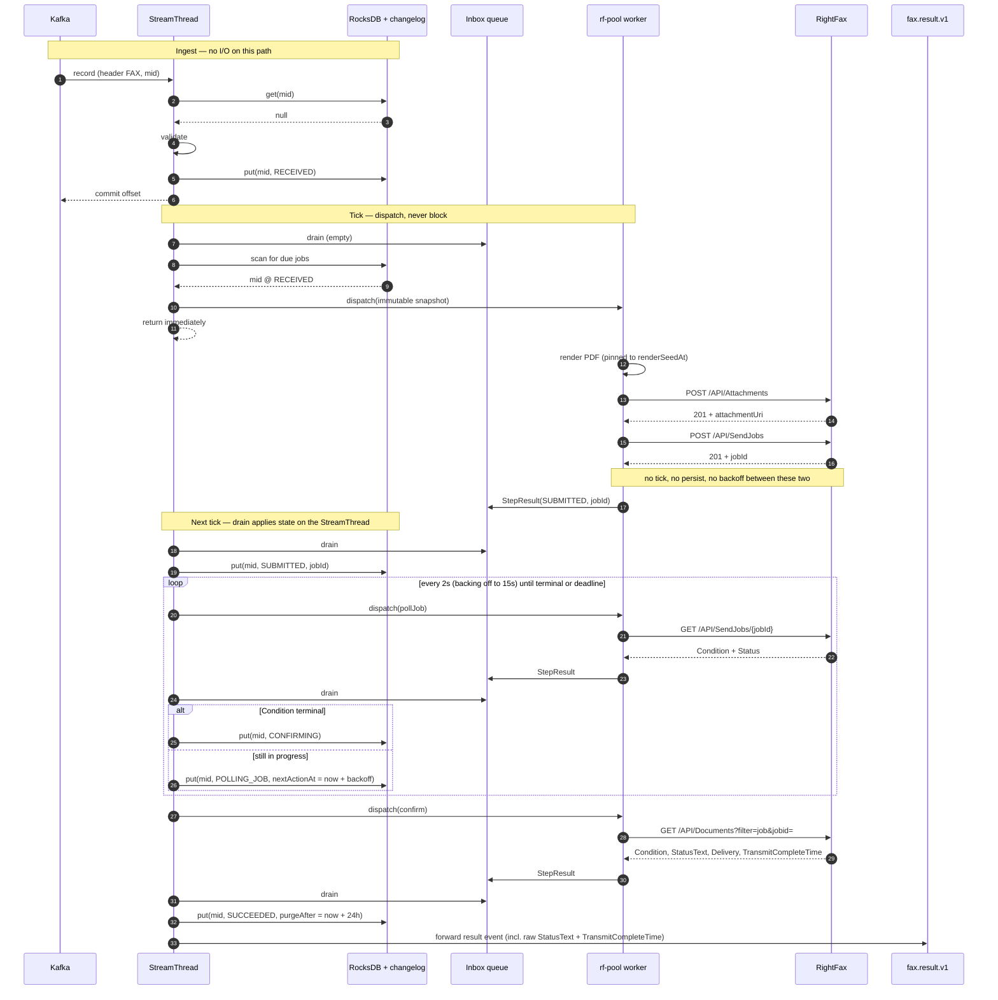
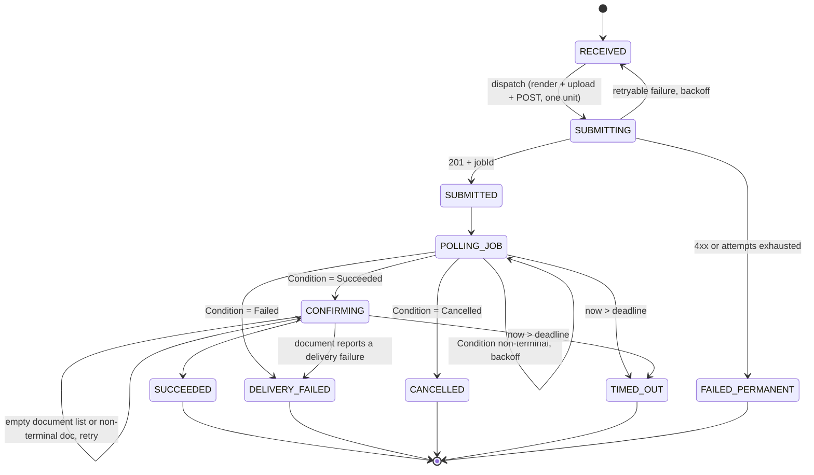

# Implementation Brief: RightFax Fax Delivery via Kafka Streams

You are implementing a new fax delivery path in an existing Spring Boot application.
This document is the complete specification. Read all of it before writing code — several
requirements exist to prevent specific failure modes, and the reasons are given so you
don't "simplify" them away.

---

## 1. What we are building

We consume messages from a Kafka topic. Messages tagged as fax requests must be rendered
to a PDF, submitted to an on-premise OpenText RightFax server over its REST Web API, and
then tracked until the fax reaches a terminal delivery status. Terminal outcomes are
published to a result topic.

Volume is about **1,000 faxes per month** (roughly 1.4 per hour). A fax normally reaches
a terminal status in about 30 seconds, but can take several minutes if RightFax has to
retry a busy or unanswered line.

Kafka Streams is used **only** to get a durable, changelog-backed RocksDB key-value store.
We are not using it for joins, aggregations, or windowing. There is **no external
database** — do not introduce one.

### RightFax API sequence (verified against SIT)

```
GET  /API/login                              -> HTTP Basic; returns an rf-auth cookie
POST /API/Attachments                        -> multipart PDF; 201 + attachment URI
POST /API/SendJobs                           -> 201 + SendJob id
GET  /API/SendJobs/{id}                      -> poll; returns Condition + Status
GET  /API/Documents?filter=job&jobid={id}    -> the outbound Document(s) for that job
```

Base URL, credentials, and the existing poll interval are already in `application.yaml`.
Reuse them. Do not hardcode connection details in Java.

### The one unresolved question — read this before writing the polling step

SIT testing confirms `GET /API/SendJobs/{id}` reaches a terminal-looking result:
`Condition=Succeeded`, `Status=SendJobCompletion`. What is **not** confirmed is whether
that means the fax was transmitted to the recipient, or only that the job finished its own
workflow — converting the attachment, expanding recipients, and generating one outbound
Document per recipient.

Reasons to doubt it means transmission:

- `Condition` and `Status` are also field names on the **Document** resource, so identical
  values on a SendJob do not necessarily carry the same meaning.
- `Status=SendJobCompletion` names a stage of the *job* workflow.
- The Document resource carries `TransmitCompleteTime`, `StatusText`, `Delivery`, and
  `CanRetry`. The SendJob has no equivalent, because the job does not transmit anything.
- SIT reaches terminal inside a 60-second budget every time. A genuinely busy or
  unanswered line would put RightFax into its dial retry schedule and take far longer.

**Do not resolve this by guessing, and do not pick one and hardcode it.** Implement the
polling step so either answer works, switched by a single config value
(`documentConfirmation`, §3). Run the spike in §7.0 and set the value from the result.

---

## 2. Non-negotiable constraints

These are decisions already made. Implement them as written; do not re-litigate them in
code.

1. **`processing.guarantee` MUST be `at_least_once`.** Not `exactly_once_v2`. Under EOS,
   an unclean shutdown discards local state and rebuilds the store from the changelog only
   up to the last committed offset — which rolls back the write that saved the RightFax
   job id. We would restart with no job id, reprocess the input, and send a second fax
   while the first is untracked. ALOS produces the changelog record immediately, so it
   survives the restore. This is the single most important config line in the project.

2. **Rare duplicate faxes are acceptable.** If a submit response is lost, retry. Do not
   build manual-recovery queues, hold/release two-phase submission, or reconciliation
   sweeps. Just count the occurrences so the assumption can be checked later.

3. **The uploaded attachment link expires quickly.** Attachment upload and SendJob
   creation happen inside one uninterrupted unit of work. No state persist, no backoff,
   no punctuator tick between them. On any retry, if the stored attachment URI is older
   than the TTL minus a safety margin, discard it and re-render + re-upload from scratch.

4. **RocksDB state stores can only be read or written from the StreamThread.** Worker
   threads must never touch the store. This shapes the whole threading design (§4).

5. **No external datastore.** State lives in the Kafka Streams state store.

---

## 3. Configuration

```java
@ConfigurationProperties(prefix = "fax.rightfax")
@Validated
public record RightFaxProperties(
        @NotNull URI baseUrl,
        @NotBlank String username,
        @NotBlank String password,
        @NotBlank String senderUserId,

        Duration punctuateInterval,      // 2s
        int maxDispatchPerTick,          // 20
        int workerPoolSize,              // 4

        Duration connectTimeout,         // 3s
        Duration uploadTimeout,          // 20s
        Duration submitTimeout,          // 15s
        Duration queryTimeout,           // 8s

        Duration firstPollDelay,         // 5s  -- job workflow completes fast
        Duration pollInterval,           // 2s  -- matches existing application.yaml
        double pollBackoffMultiplier,    // 1.5
        Duration pollMaxInterval,        // 15s
        Duration deadline,               // 15m -- see note
        Duration terminalRetention,      // 24h

        DocumentConfirmation documentConfirmation,   // AUDIT_ONLY until the spike says otherwise

        Duration attachmentTtl,          // 5m   -- CONFIRM with the RightFax team
        Duration attachmentSafetyMargin, // 60s

        int maxSubmitAttempts,           // 4
        int maxResolveAttempts,          // 10
        int maxLoginsPerMinute           // 5
) {}
```

```java
public enum DocumentConfirmation {
    /** Job Condition=Succeeded is treated as the terminal outcome. One Documents call is
     *  still made to capture StatusText / Delivery / TransmitCompleteTime for the audit
     *  record. If that call fails, the fax still completes successfully. */
    AUDIT_ONLY,

    /** Job Condition=Succeeded is NOT terminal. The Document must be polled to its own
     *  terminal status before the fax is considered delivered. */
    REQUIRED,

    /** No Documents call at all. Only for a fallback if the endpoint is unavailable. */
    DISABLED
}
```

Default to `AUDIT_ONLY`. Flipping to `REQUIRED` must be a config change, not a code
change — that is the entire point of the enum.

Note on `deadline`: 30 seconds is the happy path only. When the far end is busy or does
not answer, RightFax runs its own dial retry schedule and status stays non-terminal for
minutes. Default to 15 minutes. `TIMED_OUT` means **"we stopped watching"**, not
"the fax failed" — publish it as an indeterminate outcome, never as a delivery failure.

The existing `application.yaml` caps polling with `max-attempts: 30` at a 2s interval —
a 60-second ceiling. **Replace that with the deadline.** An attempt cap silently becomes
a shorter timeout as soon as backoff is introduced, and 60 seconds is far too short for
any case where RightFax has to redial. Keep the 2s starting interval; drop the counter.

Streams config:

```java
props.put(StreamsConfig.PROCESSING_GUARANTEE_CONFIG, StreamsConfig.AT_LEAST_ONCE);
props.put(StreamsConfig.NUM_STANDBY_REPLICAS_CONFIG, 1);
props.put(StreamsConfig.COMMIT_INTERVAL_MS_CONFIG, 1000);
props.put(StreamsConfig.CACHE_MAX_BYTES_BUFFERING_CONFIG, 0);   // see §5
props.put(StreamsConfig.MAX_POLL_INTERVAL_MS_CONFIG, 600_000);
```

---

## 4. Architecture

### 4.1 Threading model

`process()`, all punctuators, `consumer.poll()`, and offset commits run on the **same
StreamThread**. A blocking HTTP call in either `process()` or the punctuator stalls
polling for every other in-flight fax and eats into `max.poll.interval.ms`.

But RocksDB can only be written from that same thread. So the pattern is: **dispatch
off-thread, apply on-thread.**

- `process()` does no I/O. It validates, dedupes, writes `RECEIVED`, returns.
- A wall-clock punctuator fires every 2s and does exactly two things, in order:
  1. **Drain** a `ConcurrentLinkedQueue` of completed `StepResult` objects, apply the
     resulting state writes to the store, and forward any terminal results downstream.
  2. **Dispatch** due jobs to a fixed thread pool and return immediately.
- Worker threads receive an immutable `FaxState` snapshot, perform HTTP and CPU work, and
  push an immutable `StepResult` onto the queue. They touch nothing else.

**Every store write and every `context.forward()` happens in the drain step. That is the
invariant.**

### 4.2 Main flow



Under `documentConfirmation=REQUIRED`, the confirm step becomes its own polling loop
against the Document rather than a single call.

### 4.3 State machine



Terminal entries are **not deleted immediately**. Set `purgeAfter = now + 24h` and let
the punctuator tombstone them later, so a replayed input record hits the dedupe check
instead of sending a second fax.

---

## 5. Detailed requirements

### 5.1 State object

```java
public record FaxState(
        String mid,
        Phase phase,
        String destination,
        JsonNode payload,            // enough to re-render the PDF
        Instant renderSeedAt,        // pin all clock-dependent template values to this

        String attachmentUri,
        Instant attachmentUploadedAt,
        String jobId,
        String documentId,
        String rightFaxStatus,

        int submitAttempts,
        int resolveAttempts,
        int pollAttempts,

        Instant createdAt,
        Instant nextActionAt,
        Instant deadlineAt,
        Instant purgeAfter,

        Integer lastHttpStatus,
        String lastError
) { }
```

- **Write the whole object on every `put`.** Changelog restore replays values, not deltas.
  A partial write produces an incoherent value after restore.
- **Never store PDF bytes.** They go to the changelog topic and will collide with
  `max.message.bytes`. Store `payload` + `renderSeedAt` and re-render deterministically.
- Pin every clock-dependent value in the PDF template to `renderSeedAt` so re-rendering
  after a retry produces the same document.
- Serde: Jackson JSON with `@JsonIgnoreProperties(ignoreUnknown = true)`, so a schema
  addition doesn't break restore of records written by the previous deployed version.

### 5.2 Store

```java
Stores.keyValueStoreBuilder(
        Stores.persistentKeyValueStore("fax-state"),
        Serdes.String(),
        new JsonSerde<>(FaxState.class))
    .withLoggingEnabled(Map.of(
        TopicConfig.CLEANUP_POLICY_CONFIG, TopicConfig.CLEANUP_POLICY_COMPACT,
        TopicConfig.MIN_CLEANABLE_DIRTY_RATIO_CONFIG, "0.1",
        TopicConfig.SEGMENT_MS_CONFIG, "3600000"));
    // do NOT call .withCachingEnabled()
```

Record caching must stay off. Caching batches store writes and delays the changelog
produce, which widens the window in which a crash loses the RightFax job id.

### 5.3 `process()` — no I/O

```java
public void process(Record<String, DeliveryRequest> record) {
    DeliveryRequest req = record.value();
    if (!Channel.FAX.equals(req.channel())) return;

    FaxState existing = store.get(req.mid());
    if (existing != null) {
        meters.counter("fax.ingest.duplicate", "phase", existing.phase().name()).increment();
        return;
    }
    try {
        validator.validate(req);
    } catch (FaxValidationException e) {
        context.forward(record.withValue(dlq(req, e)), "dlq-sink");
        return;
    }
    store.put(req.mid(), FaxState.initial(req, Instant.now(clock), props.deadline()));
}
```

Validation failures are the only case where we can be certain no fax exists — they go
straight to the DLQ with no state entry.

### 5.4 Punctuator

Use `PunctuationType.WALL_CLOCK_TIME`. **Do not use `STREAM_TIME`** — at 1.4 records/hour
stream time is effectively frozen between messages, and the punctuator would fire in
bursts tied to input arrival rather than elapsed time.

Track in-flight MIDs in a plain heap-side `Set<String>` owned by the processor instance.
**Do not persist it.** After a crash the set is empty and every restored non-terminal
record is re-dispatched, which is exactly what we want. If you persisted it, a crash
mid-call would leave jobs permanently marked in-flight with nothing to clear them.

Rules for the dispatch scan:

- If the circuit breaker is OPEN, return immediately. Do not iterate a batch of work that
  cannot be served.
- Skip entries already in the in-flight set, and entries whose `nextActionAt` is in the
  future.
- If `now > deadlineAt`, push a synthetic `StepResult` onto the inbox rather than mutating
  state inline — all state writes stay in the drain step.
- Stop after `maxDispatchPerTick`. This bounds the burst right after a restore, when every
  restored record is simultaneously due.
- **Never delete from the store while iterating it.** Collect MIDs to tombstone, close the
  iterator, then delete. The iterator is over a RocksDB snapshot.
- **Always close the iterator** (try-with-resources). A leaked `KeyValueIterator` pins
  RocksDB resources and will eventually take the instance down.

`store.all()` is a full scan every 2 seconds. At this volume the store holds roughly 35–50
live records, so this is fine. Do not build a time-bucketed secondary index.

### 5.5 Worker

Runs off the StreamThread. Reads only the immutable snapshot it was handed. Its only
output is a `StepResult` on the inbox queue.

Submit step, in strict order:

1. Render the PDF from `payload` + `renderSeedAt`. A render failure is permanent → do not
   retry.
2. `POST /API/Attachments`.
3. Immediately `POST /API/SendJobs`. Nothing between steps 2 and 3.
4. On failure at step 3, delete the attachment (ignore a 404) and return a retryable
   result. On a permanent 4xx, terminate the fax.

Attachment reuse check on any retry:

```java
boolean usable = s.attachmentUri() != null
    && now.isBefore(s.attachmentUploadedAt()
                     .plus(props.attachmentTtl())
                     .minus(props.attachmentSafetyMargin()));
```

If not usable, re-render and re-upload. Re-rendering is cheap; a stale attachment
reference produces a confusing 4xx and a failed fax.

Job poll step: `GET /API/SendJobs/{jobId}`. Read `Condition` for the outcome and `Status`
for the workflow stage. Classify with the SendJob map in §5.6.

Confirm step: `GET /API/Documents?filter=job&jobid={id}` with `userId`, `skip`, and `top`
pinned. An empty list immediately after the job goes terminal is normal — RightFax takes a
moment to materialise the document. Retry up to `maxResolveAttempts`.

Behaviour on confirm depends on `documentConfirmation`:

- `AUDIT_ONLY` — capture `Condition`, `StatusText`, `Delivery`, `TransmitCompleteTime`
  into the result event. If the call fails or the list stays empty, log a warning,
  increment `fax.confirm.unavailable`, and complete the fax as `SUCCEEDED` anyway. The
  job's verdict stands.
- `REQUIRED` — the document's own status is the verdict. Keep polling it to terminal.
  A `SUCCEEDED` job with a document that later fails becomes `DELIVERY_FAILED`.
- `DISABLED` — skip the call entirely.

Whichever mode, if the document reports a delivery failure while the job said Succeeded,
**log this at ERROR and increment `fax.confirm.disagreement`.** That counter firing even
once means `AUDIT_ONLY` is the wrong setting and the config must move to `REQUIRED`.

### 5.6 Status classification

Two separate maps. `Condition` and `Status` appear on both the SendJob and the Document
resource and do not necessarily mean the same thing, so do not share one map between them.

```java
// SendJob.Condition — verified in SIT: Succeeded arrives with Status=SendJobCompletion
private static final Map<String, Outcome> JOB_CONDITION = Map.ofEntries(
        entry("Succeeded", Outcome.SENT),
        entry("Failed",    Outcome.FAILED),
        entry("Cancelled", Outcome.CANCELLED),
        entry("Pending",   Outcome.IN_FLIGHT),
        entry("InProgress",Outcome.IN_FLIGHT));

// Document status — confirm the exact strings for our version (§9)
private static final Map<String, Outcome> DOC_STATUS = Map.ofEntries(
        entry("Sent",            Outcome.SENT),
        entry("OK",              Outcome.SENT),
        entry("Error",           Outcome.FAILED),
        entry("RetriesExceeded", Outcome.FAILED),
        entry("BadDestination",  Outcome.FAILED),
        entry("Cancelled",       Outcome.CANCELLED),
        entry("Deleted",         Outcome.CANCELLED),
        entry("Pending",         Outcome.IN_FLIGHT),
        entry("InProgress",      Outcome.IN_FLIGHT),
        entry("Converting",      Outcome.IN_FLIGHT),
        entry("Retrying",        Outcome.IN_FLIGHT),   // dial retry — NOT a failure
        entry("NoLine",          Outcome.IN_FLIGHT),   // no channel — NOT a failure
        entry("Held",            Outcome.IN_FLIGHT));
```

The `Status` field on the SendJob (`SendJobCompletion` and friends) is the workflow stage,
not the outcome. Log it and carry it into the result event, but drive the state machine
off `Condition`.

Unknown status values map to `IN_FLIGHT`, log at WARN, and increment
`fax.status.unmapped`. **Never** default an unrecognised status to failure.

`Retrying` and `NoLine` are the two that cause incidents when misclassified — they look
like errors and are not.

Carry the raw RightFax status string verbatim into the result event. Operations needs to
distinguish `BadDestination` from `NoAnswer` to decide whether to re-key a number.

**A failed status API call is not a failed fax.** A 503 on the polling GET means we
currently cannot determine status. Back off and retry; do not mark the fax failed.

### 5.7 HTTP client

```java
CloseableHttpClient http = HttpClients.custom()
        .setConnectionManager(pooled)
        .disableAutomaticRetries()      // REQUIRED — see below
        .disableCookieManagement()      // we carry rf-auth explicitly
        .disableRedirectHandling()
        .evictIdleConnections(TimeValue.ofSeconds(30))
        .build();
```

`disableAutomaticRetries()` is required. Apache HttpClient's default handler silently
re-sends on `NoHttpResponseException` — the exact ambiguous case. Left enabled, duplicate
faxes happen while the ambiguity counter reads zero, and we lose the ability to check
whether the "duplicates are rare" assumption holds.

Do not use a shared `CookieStore`. Hold the `rf-auth` cookie in an `AtomicReference` and
refresh it single-flight under a `ReentrantLock` with a generation counter, so four worker
threads hitting a shared 401 produce one login rather than four. Rate-limit logins to
`maxLoginsPerMinute` — RightFax accounts can lock out on repeated auth failures.

### 5.8 Exception taxonomy

```java
RightFaxException.NotSent     // ConnectException, UnknownHostException, breaker open
RightFaxException.Ambiguous   // read timeout, NoHttpResponseException, reset after write,
                              //   and 5xx on a POST (the request reached the app)
RightFaxException.Permanent   // 400, 404, 409, 422
RightFaxException.Transient   // 429, 503
RightFaxException.Auth        // 401, 403
```

`Ambiguous` and `NotSent` share the same retry path. They are kept distinct only so the
`fax.submit.ambiguous` metric is meaningful.

Resilience4j: one circuit breaker for the RightFax host. Apply `@Retry` to GETs and
DELETEs only. **Do not put a retry annotation on the SendJob create** — its retry is a
state machine transition with a freshly uploaded attachment, not an in-process resend.
Set `ignoreExceptions` to include `Permanent` and `Auth` so a run of bad fax numbers does
not trip the breaker and stall healthy traffic.

### 5.9 Streams handlers and shutdown

```java
props.put(DEFAULT_DESERIALIZATION_EXCEPTION_HANDLER_CLASS_CONFIG,
          DlqDeserializationExceptionHandler.class);   // CONTINUE + raw bytes to DLQ
props.put(DEFAULT_PRODUCTION_EXCEPTION_HANDLER_CLASS_CONFIG,
          DlqProductionExceptionHandler.class);        // CONTINUE on RecordTooLarge

streams.setUncaughtExceptionHandler(ex ->
        ex instanceof TaskCorruptedException || ex instanceof TimeoutException
                ? REPLACE_THREAD : SHUTDOWN_CLIENT);
```

On `close()`: shut down the executor, await termination, then drain the inbox one final
time so in-flight results are persisted before the instance leaves the group.

### 5.10 Topics

- `fax.result.v1` — every terminal outcome, success and delivery failure alike, keyed by
  MID. This is the **only** audit trail: RocksDB entries are tombstoned after 24h, so
  nothing else records that the fax existed. Include MID, job id, document id, raw
  RightFax status, attempt counts, `createdAt`, and `terminalAt`.
- `fax.dlq.v1` — unprocessable input only (validation failures, deserialization failures).
  A fax that RightFax genuinely could not deliver is a **business outcome**, not a poison
  message — it goes to the result topic. Replaying a DLQ full of legitimately failed faxes
  would resend faxes.

---

## 6. Observability

| Metric | Type | Purpose |
|---|---|---|
| `fax.ingest.{accepted,duplicate,invalid}` | counter | volume and replay rate |
| `fax.terminal{phase}` | counter | outcome mix |
| `fax.duration` | timer | validates the 30s assumption, tunes the deadline |
| `fax.submit.ambiguous` | counter | **the duplicate-risk gauge** |
| `fax.inflight` | gauge | should hover near zero |
| `fax.oldest_pending_age` | gauge | leading indicator of a stuck fax |
| `fax.status.unmapped{status}` | counter | catches RightFax version drift |
| `fax.dispatch.skipped.breaker` | counter | outage duration |
| `fax.punctuator.duration` | timer | must stay near zero — if not, something is blocking |

Add a Streams interactive-query endpoint for support, since RocksDB is not queryable from
outside:

```java
@GetMapping("/ops/fax/{mid}")
public FaxState lookup(@PathVariable String mid) {
    return streams.store(StoreQueryParameters.fromNameAndType(
            "fax-state", QueryableStoreTypes.<String, FaxState>keyValueStore())).get(mid);
}
```

With a single partition this always resolves locally.

---

## 7. Acceptance tests

### 7.0 Spike — run this against SIT before finalising the polling step

This is manual work against the real server, not automated tests. Record the answers in
this document and set `documentConfirmation` accordingly.

**S1.** Submit a fax. The instant `GET /API/SendJobs/{id}` reports
`Condition=Succeeded`, immediately call `GET /API/Documents?filter=job&jobid={id}` and
record the document's `Condition`, `Status`, `StatusText`, and `TransmitCompleteTime`.
If the document is still Pending/InProgress, or `TransmitCompleteTime` is null while the
job says Succeeded, the job's verdict is job-completion, not delivery →
`documentConfirmation=REQUIRED`.

**S2.** Send to a number that must fail — disconnected, or one that rings unanswered.
Does the SendJob ever report a `Condition` other than `Succeeded`? If it still reports
Succeeded, it is definitively not tracking delivery → `REQUIRED`.

**S3.** Send to a busy line, or have the fax team take the channel down. Record how long
the SendJob takes to go terminal versus the Document. This number sets `deadline`.

**S4.** Ask what the SIT fax channel is actually connected to. If it is a simulator or a
loopback board rather than a real line, every send succeeds instantly and none of the
timings from S1–S3 are representative. Say so explicitly in the findings rather than
carrying simulator numbers into production config.

**S5.** Record the exact `Condition` and `Status` string values observed, for both
resources, and reconcile them with the maps in §5.6.

### 7.1 Automated tests

Use WireMock for RightFax and Testcontainers for Kafka. These tests are the deliverable as
much as the code is.

**Crash recovery**

1. Kill the JVM after `put(RECEIVED)` but before dispatch → restart → exactly one fax.
2. Kill after `POST /SendJobs` returns 201 but before `put(SUBMITTED)` → restart → assert a
   second submit occurs and the duplicate/ambiguous counters reflect it. This test
   documents an accepted risk; it must fail loudly if someone "fixes" it wrongly.
3. Kill during `POLLING` → restart → polling resumes on the same `documentId`, no resubmit.
4. **Run test 3 under `exactly_once_v2` and assert it BREAKS.** Someone will eventually
   open a PR switching the guarantee because EOS sounds stronger. This test is the only
   thing that will explain why that silently destroys crash recovery.

**Attachment TTL**

5. Attachment upload succeeds, SendJob returns 503 → the retry re-renders and re-uploads
   rather than reusing the URI.
6. Advance the clock past `attachmentTtl` between attempts → assert re-upload.

**Status handling**

7. `GET /Documents?filter=job` returns empty three times then a document → confirm step
   retries, fax is not failed.
8. Job poll returns `InProgress` twice then `Succeeded` → stays `POLLING_JOB`, then
   `CONFIRMING`, then `SUCCEEDED`.
9. Either poll returns an unmapped `Condition` or status → `IN_FLIGHT`, WARN logged,
   counter incremented. Never a failure.
10. Poll returns 503 for the full deadline → `TIMED_OUT`, published as indeterminate, not
    as a delivery failure.
11. Document poll returns `Retrying` then `NoLine` then `Sent` under
    `documentConfirmation=REQUIRED` → stays `CONFIRMING`, ends `SUCCEEDED`.
12. Job reports `Succeeded` but the document reports `BadDestination` → under
    `AUDIT_ONLY`, fax completes as `SUCCEEDED` and `fax.confirm.disagreement` fires;
    under `REQUIRED`, fax completes as `DELIVERY_FAILED`. Assert both modes.
13. Job reports `Succeeded`, the Documents call returns 503 → under `AUDIT_ONLY` the fax
    still completes successfully with `fax.confirm.unavailable` incremented.

**Threading**

11. Make the RightFax mock block for 60s → assert `fax.punctuator.duration` stays under
    100ms and other in-flight faxes continue polling. This proves the punctuator is not
    blocking.

**Dedupe**

12. Replay the same input record three times → exactly one fax.
13. Replay a record whose MID is terminal within 24h → no new fax. Replay at 25h → a new
    fax (this documents the retention trade-off).

**Compatibility**

14. Restore a changelog containing records written by the previous schema version → assert
    deserialization succeeds.

---

## 8. Things not to do

- Do not switch to `exactly_once_v2`.
- Do not make HTTP calls from `process()` or from inside the punctuator body.
- Do not write to the state store from a worker thread.
- Do not enable record caching on the store.
- Do not store PDF bytes in the state store.
- Do not persist the in-flight set.
- Do not delete from the store while iterating it.
- Do not persist state between the attachment upload and the SendJob create.
- Do not hardcode whether the SendJob verdict means "delivered". Route it through
  `documentConfirmation` so the spike result is a config change.
- Do not share one status map between the SendJob and Document resources.
- Do not keep the `max-attempts: 30` polling cap. Use the deadline.
- Do not default an unrecognised RightFax `Condition` or status to failure.
- Do not route delivery failures to the DLQ.
- Do not add an external database, a separate worker service, or extra Kafka topics beyond
  the two named above.
- Do not add in-process retries to the SendJob create call.

---

## 9. Open items — ask before assuming

If these are not already answered in the repo or config, flag them rather than guessing:

1. **Whether `SendJob.Condition=Succeeded` means transmitted or job-complete.** Answered
   by spike S1/S2, not by asking. Everything else here is secondary to this.
2. Exact attachment expiry (TTL) on the RightFax server, and whether
   `DELETE /API/Attachments/{id}` exists. Currently assumed at 5 minutes.
3. The dial retry configuration for our class of service (attempts × interval). This sets
   the deadline value, currently a 15-minute guess.
4. The full `Condition` enumeration for SendJob and the full status enumeration for
   Document, for our RightFax version — specifically the exact spellings of the retry and
   no-channel states.
5. Typical lag between the job going terminal and the document appearing in
   `/API/Documents?filter=job`.
6. `rf-auth` session lifetime and idle timeout.
7. Whether a coversheet is generated by default for API-submitted jobs.
8. What the SIT fax channel is connected to — a real line, or a simulator (spike S4).
